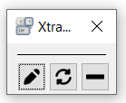

# О приложении

Это приложение - набор конфигурируемых кнопок и соответствующих настроек:

- заголовок кнопки,
- опциональные горячие клавиши,
- прикреплённая команда (скрипт, файл), которая может быть выполнена с помощью приложения по умолчанию.

Эти настройки описаны в специальном файле и могут быть обновлены прямо из приложения.

# Интерфейс

#### Нет настроеных команд:



#### Настроены две команды:


# Управляющие кнопки

-  - редактировать файл настроек (__Ctrl+E__),
-  - перезагрузить настройки (__Ctrl+R__),
-  - свернуть окно (__Ctrl+M__).

# Файл настроек

```
<config>
  <vars>
    <var name="VAR_FROM_VARS" val="someValue" />
  </vars>
  <cmds>
    <cmd name="Первая кнопка" val="path/to/file" />
    <cmd name="Вторая кнопка" val="${SYS_VAR}/file" />
    <cmd name="Третья кнопка" val="${VAR_FROM_VARS}/file" />
    <cmd name="Use &amp;Shortcut" val="some_cmd" />
  </cmds>
</config>
```

## Секция __config__

Корневая секция.

### Секция __vars__

В этой секции можно задавать свои переменные.

#### Тег __var__

Данный тег описывает пользовательские переменные. Атрибуты:

- __name__ описывает имя переменной,
- __val__ описывает значение переменной, например, путь.

### Секция __cmds__

В этой секции можно задавать команды.

#### Тег __cmd__

Данный тег описывает команду. Атрибуты:

- __name__ задаёт имя кнопки,
- __val__ задаёт путь команды, например, файла или скрипта.

В атрибуте __name__ можно задать горячие клавиши. Чтобы установить сочетание, перед желаемой буквой нужно прописать `&amp;`. Например, для команды `<cmd name="Use &amp;Shortcut" val="some_cmd" />` будет установлено сочетание __Alt+S__.
